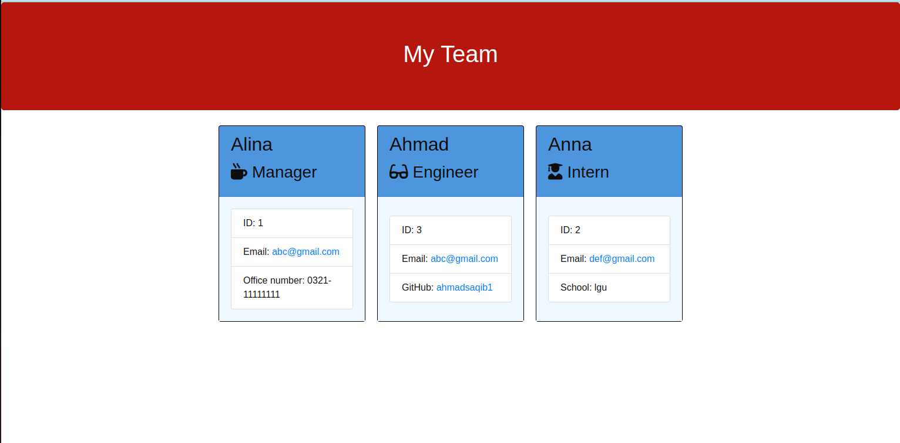

## Team Profile Generator

## Overview

This application takes in information about employees on a software engineering team, then generate a HTML webpage that displays summaries for each person. This code uses jest package for testing and inquirer package for gathering information from user.

## Website visuals

The following image shows the web application's appearance and functionality:

## Technologies

- HTML
- CSS
- Node.js

## Website

https://github.com/ahmadsaqib1/team-profile-generator

## Contributions

Made by Ahmad Saqib
